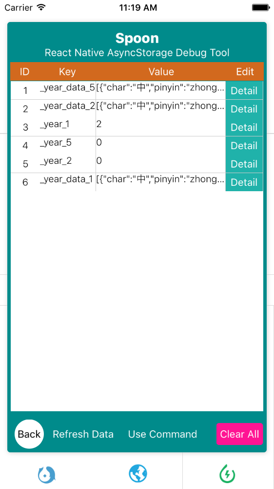
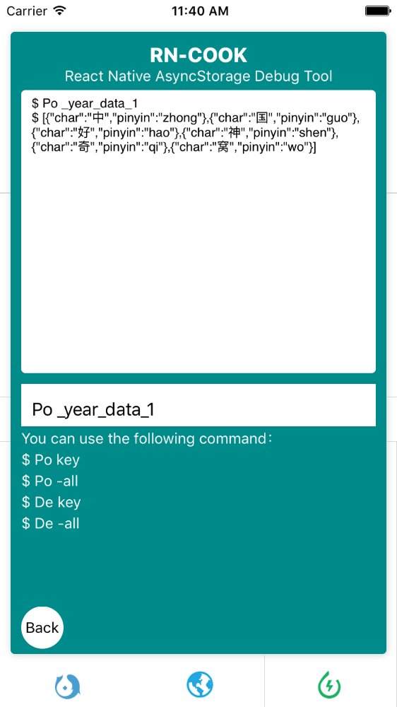
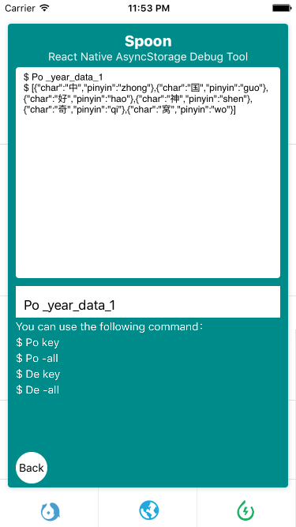
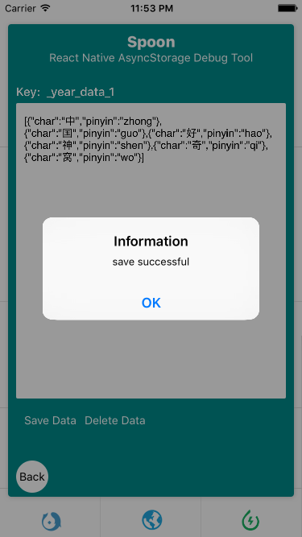

# A4
 React Native AsyncStorage Debugger         
 
## Why 
AsyncStorage is very difficult to debug. I want to develop a tool that have a UI Interface. So, I did.   

	$ npm install a4 --save
 
## How to use       

	//1) install module
		$ npm install a4 --save
	
	//2) import module
		import Spoon from 'a4';
	
	//3) write component on bottom of view container
		<Spoon/> 
		
	//4) for example
		<ScrollView style={styles.flex_1}>
        <View style={styles.logo}></View>
        <Text style={styles.fontTitle}>
         Read
        </Text>
        <Recommend/>
        <View style={styles.hr}></View>
        <Text style={styles.fontTitle}>
          Study
        </Text>
        <Grade navigator={this.props.navigator}/>
        <View style={styles.hr}></View>
        <Text style={styles.fontTitle}>
          Category
        </Text>
        <Category navigator={this.props.navigator}/>
        <CopyRight navigator={this.props.navigator}/>
        
        <Spoon/>
      </ScrollView>	
    
## Show Case 
### Table 
        
### Detail info       
   
### Command     
   
### Edit value    
            
 
       
 
 

